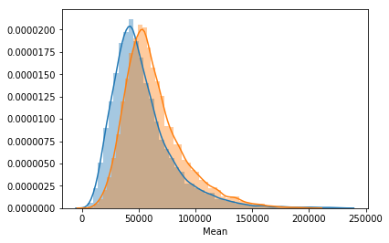
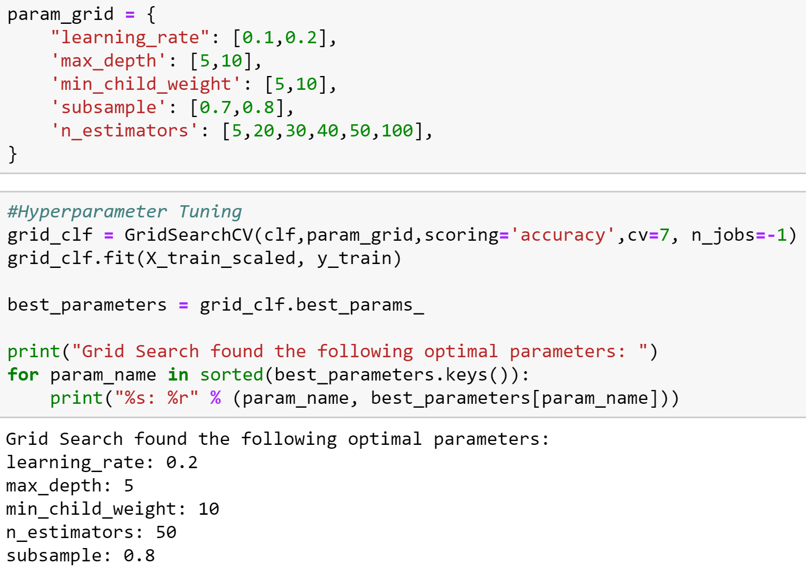
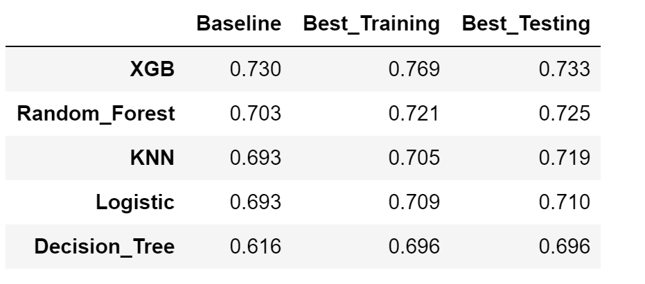
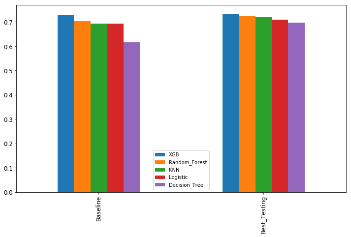
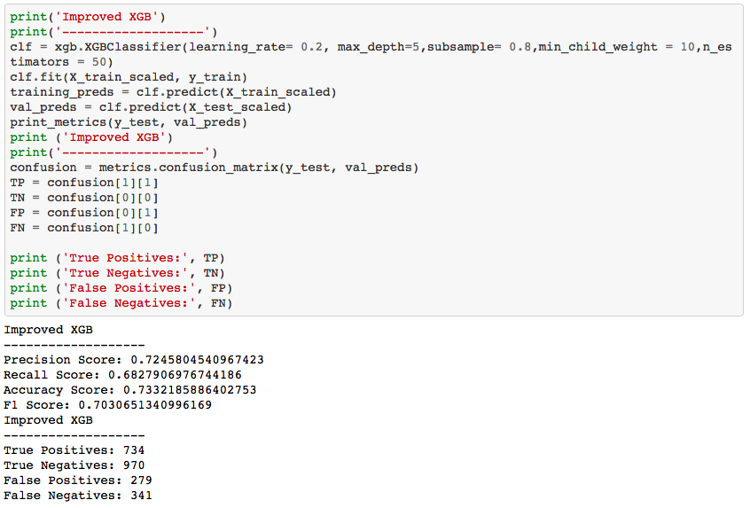
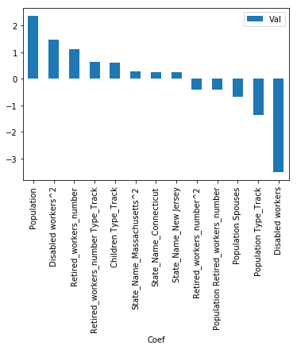

# Predicting if the Median Household of a Zip Code in the United States is Above/Under 49,000$

This model predicts the median income per household (over/under $49,000) in US zip codes based on geography and social security payments.  That analysis would provide insight on the relationship between certain demographic variables and income. 

As a first step in creating this model, in order to get a better understandign of the data, EDA was conducted and a visualization was produced using Matplotlib and Seaborn.

Next, to select the best algorythm for the model, Gridsearch and hyper-parameter tuning were applied to five classifiers: XGBoost, Random Forest, KNN, Logistic Regression, and Decision Tree. Based on comparisons of the accuracy score, XGBoost classifier was chosen for the final model.

Sources of data: US Census Report & Social Security Administration.

## Data Cleaning and Merging
I worked with four different datasets, comprising of over 30,000 rows.

Issues to be dealt with included:

-Duplication

-Small number of people in a zip code

-Null/Wrong values

My final dataset before feature engineering was a concatenation of 4 datasets and had 11,260 rows and 12 columns. 
I chose the number 49,000$ as my target over/under income, in order to get relatively balanced numbers in the target value.

#### Values Count related to $49,000: Over - 47% , Under - 53%

One example from my EDA - Household median and mean income per zip code has relatively normal distribution:

## Features Engineering and Selection
After creating dummy variables and dropping columns with multicollinearity, the dataset had 68 columns. Accuracy Score for this dataset was 0.547.

My next steps were as follows:

-Creating polynomials and interactions (total number of columns: 2415)

-Scaling the data with SKLearn StandardScaler

-Selection of best 50 features out of the 2415, using SKLearn SelectKBest (F regression).

Following is en example of the hyper-parameter tuning for the XGBoost classifier:

## Model Comparison before and after Hyper-parameter Tuning

The model with the best result after Hyper-parameter tuning used the *XGBoost Classifier* and reached a 0.733 accuracy.

## Conclusions

-The State where the zip code is located has big influence, especially when dealing with wealthy or poor states (Connecticut and Puerto Rico for example). 

-Some combinations of size of population and isolated places has an influence toward low income prediction.

-High percentage of retired workers is sometime a sign for higher median income (probably because wealthy people move to specific areas after retirement).

-The number of people with disabilities has some influence to predict that the area has relatively lower incomes.

Here is one example of a classifier feature importance( this one is from the logistic regression):

## Future Development:

With additional data (for example, tax collection), and with including all US zip codes in the dataset (this model includes roughly 33% of them), the prediction can be further refined. 

